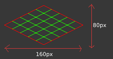

# Map

## Isometric/Cartesian

While the game is rendered in an Isometric projection (45° rotation clockwise + "squash" on the Y-axis) for a 3D effect, the entire simulation/physics is done in standard 2D Cartesian.

The position of an Entity is driven by its `Position` Component (from the Avian crate). It is then automatically synced to the `Transform` Component, where the Cartesian to Isometric transformation is applied.

## Grid/Tiles

Maps are grid-based. They are composed of tiles and subtiles (named `RenderTiles` and `NavTiles`).

As the name suggests, a RenderTile represents one rendered asset of `80x80` in Cartesian coordinates and `160x80` in isometric (so assets in the atlas have a size of 160x80px).

Each RenderTile is subdivided into 5x5 (25) NavTiles, which are used for navigation purposes (colliders/pathfinding). So, one NavTile has a size of `16x16` in Cartesian coordinates and `32x16` in isometric.

Here is a figure representing one RenderTile and its NavTiles:

<figure style="text-align: center;">
    
    <figcaption>RED = RenderTile | GREEN = NavTiles</figcaption>
</figure>

## Meter unit

The game provide a const named `PIXEL_METER` which represent the equivalent of 1 meter in term of pixels (currently 32).

All values (movement speed/distance...) should be defined using it. For example if you want to define the max distance of a projectile to be 10 meters, defined it as `let max_distance = 10 * PIXEL_METER;` and never `let max_distance = 3200.;`.